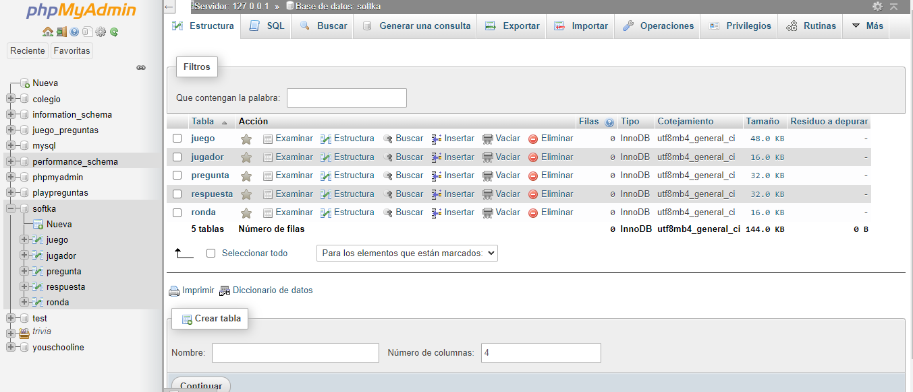
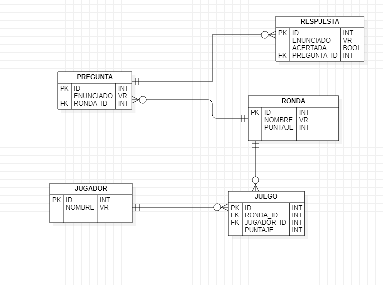
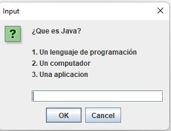

# JavaPreguntas-- Proyecto sofka.
Este proyecto es realizado con mis conocimientos obtenidos tanto en el diplomado que realice en el año 2021 de MISIONTIC, desarrollandolo con mis habilidades,

La informacion de este proyecto se almaceno en la base de datos MySQL, por medio del modulo XAMPP, el nombre de la base datos que se le asigno a este proyecto es : softka y el puerto de conexión usado es localhost:3306.

# Modelo ER
Diseñado en la aplicacion StartUML

# Creacion de tablas para almacenar información de premios, categorias, preguntas , opciones de respuesta y jugadores. 

CREATE TABLE appPremio (
id INTEGER (10) AUTO_INCREMENT PRIMARY KEY, 
valor INTEGER (10), idRonda INTEGER (10) );

CREATE TABLE appCategoria ( 
id INTEGER (10) AUTO_INCREMENT PRIMARY KEY, name varchar (10) );

CREATE TABLE appPregunta ( 
id INTEGER (10) AUTO_INCREMENT PRIMARY KEY, 
categoria varchar (10),
enunciado varchar (10),
opciones varchar (250),
idRonda INTEGER (10) );

CREATE TABLE appOpciones ( 
id INTEGER (10) AUTO_INCREMENT PRIMARY KEY, 
enunciado varchar (250), 
opcionCorrecta boolean );

CREATE TABLE appJugador ( 
id INTEGER (10) AUTO_INCREMENT PRIMARY KEY, 
name varchar (10), 
premioTotal INTEGER (10));

# Queries creacion base de datos de las entidades Ronda,Pregunta,Respuesta,Jugador y Juego

CREATE TABLE RONDA(
ID INTEGER(10) AUTO_INCREMENT PRIMARY KEY,
NOMBRE VARCHAR(50),
PUNTAJE INT

);
CREATE TABLE JUGADOR(
ID INTEGER(10) AUTO_INCREMENT PRIMARY KEY,
NAME_JUGA VARCHAR(50)

);

CREATE TABLE PREGUNTA(
ID INTEGER(10) AUTO_INCREMENT PRIMARY KEY,
ENUNCIADO VARCHAR(50),
RONDA_ID INT,
FOREIGN KEY(RONDA_ID)REFERENCES ronda(ID)
);
CREATE TABLE RESPUESTA(
ID INTEGER(10) AUTO_INCREMENT PRIMARY KEY,
ENUNCIADO VARCHAR(50),
ACERTADA BOOLEAN,
PREGUNTA_ID INT,
FOREIGN KEY(PREGUNTA_ID)REFERENCES pregunta(ID)
)
CREATE TABLE JUEGO(
ID INTEGER(10) AUTO_INCREMENT PRIMARY KEY,
PUNTAJE INT,
ID_RONDA INT,
ID_JUGADOR INT,
FOREIGN KEY(ID_RONDA)REFERENCES ronda(ID),
FOREIGN KEY(ID_JUGADOR)REFERENCES jugador(ID)
)
# Inserts de cada tabla
INSERT INTO `ronda`( `NOMBRE`, `PUNTAJE`) VALUES('RONDA1',2),('RONDA2',4),('RONDA3',6),('RONDA4',8),('RONDA5',10)
INSERT INTO `pregunta`( `ENUNCIADO`, `RONDA_ID`) VALUES
('¿Que es Java?',1),
('Java es un lenguaje..',1),
('Java lo conocemos como?',1),
('Java maneja cadenas de caracteres como?',1),
('Java utiliza tipos de datos enteros como?',1),
('¿Cual es un IDE?',2),
('Para que se utiliza Java EE',2),
('Cual no es un gestor de bases de datos relacionales? ',2),
('Cual es mas conocido para bases de datos no relacionales',2),
('Como denominamos una llave primaria',2),
('Como se denomina una llave relacional',3),
('Cual es la manera correcta de una condicion en java',3),
('Cual es la manera correcta de una iteracion en java',3),
('HTML quiere decir?',3),
('Para que se usa Css',3),
('Como denominamos un tipo estatico',4),
('Como denominamos un tipo privado',4),
('Como denominamos un tipo protegido',4),
('Que es Poo',4),
('Que es polimorfismo',4),
('Como denominamos los tipos Booleanos',5),
('Que es encapsulamiento en java',5),
('Que es abstraccion',5),
('Cual es el tipo de dato fecha',5),
('Sintaxis correcta de un arraylist en java?',5)
INSERT INTO `respuesta`( `ENUNCIADO`, `ACERTADA`, `PREGUNTA_ID`)
VALUES
('Un lenguaje de programación',true,1),
('Fuertemente Tipado',true,2),
('Un lenguaje compilado',true,3),
('String',true,4),
('int',true,5),
('intellij idea',true,6),
('Para el desarrollo web',true,7),
('Cassandra',true,8),
('MongoDB',true,9),
('PK',true,10),
('FK',true,11),
('if (condition) {return}',true,12),
('for (statement 1; statement 2; statement 3) {}',true,13),
('HyperText Markup Language',true,14),
('es un lenguaje de diseño gráfico',true,15),
('Static',true,16),
('Private',true,17),
('Protected',true,18),
('Programacion orientada objetos',true,19),
('many forms',true,20),
('True/False',true,21),
('Get/Set',true,22),
('abstract',true,23),
('Date',true,24),
('ArrayList<String> cars',true,25)
# Funcionalidad programa

